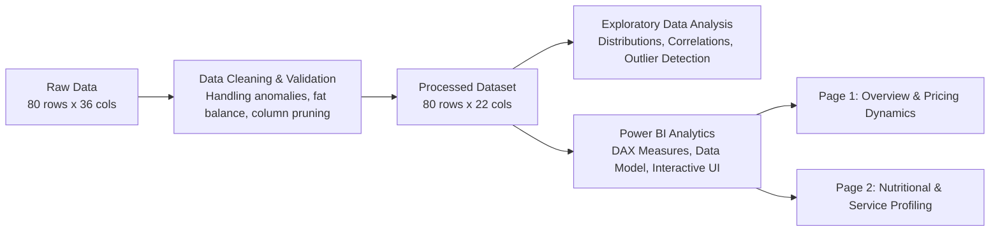

# McDonald's Menu Nutrients and Price Analysis

An end-to-end exploratory data analysis (EDA), data cleaning, and business intelligence reporting project analyzing nutritional composition, pricing structures, and operational metrics across the McDonald's food and beverage menu.

---

## Project Overview

This project provides an empirical evaluation of 80 McDonald's menu items across 9 distinct product categories. The primary objectives include:
- Profiling raw nutritional data, identifying anomalies, and cleaning inconsistent or redundant attributes.
- Evaluating the relationship between item pricing (USD) and key nutritional indicators (calories, macronutrients, sodium).
- Assessing operational characteristics such as food preparation time across product lines.
- Delivering an interactive, two-page Power BI dashboard for multi-dimensional filtering, macro tracking, and pricing analysis.



---

## Repository Structure

```text
├── analysis/
│   ├── MCdonalds_profiling_&_cleaning.ipynb   # Profiling, anomaly audit & cleaning pipeline
│   └── EDA.ipynb                              # Exploratory data analysis & statistical plotting
├── dashboard/
│   ├── MCdonalds Dashboard-1.png              # High-resolution export of Page 1 (Overview)
│   ├── MCdonalds Dashboard-2.png              # High-resolution export of Page 2 (Nutrition & Service)
│   ├── MCdonalds Dashboard.pbix               # Interactive Power BI report file
│   ├── MCdonalds Dashboard.pdf                # Multi-page PDF report export
│   ├── Screenshot 2026-10-06 171056.png       # Power BI workspace capture (Page 1)
│   └── Screenshot 2026-10-06 171108.png       # Power BI workspace capture (Page 2)
├── dashboard_frames/
│   ├── page_1_overview_background_v2.png      # Custom canvas layout for Dashboard Page 1
│   └── page_2_nutrition_service_background_v2.png # Custom canvas layout for Dashboard Page 2
├── data/
│   ├── mcdonalds_menu.csv                     # Raw dataset (80 items, 36 features)
│   └── final_mcdonalds_menu.csv               # Cleaned dataset (80 items, 22 features)
├── Dataset picture.png                        # Raw dataset tabular preview
├── .gitignore                                 # Git ignore configuration
└── README.md                                  # Project technical documentation
```

---

## Data Pipeline & Cleaning Methodology

### 1. Raw Data Ingestion & Audit
The raw dataset (`data/mcdonalds_menu.csv`) consists of 80 records and 36 attributes spanning pricing, nutritional facts, classification flags, and historical price tracking.

**Audit Findings:**
- **Zero-variance columns:** Attributes such as `calorie_density` contained constant zero values across all rows.
- **Redundant metadata:** Identifier fields (`item_id`) and natural language fields (`description`) provided no analytical utility.
- **Inconsistent calculated fields:** `price_per_calorie` and `protein_per_dollar` had arbitrary units and rounding inconsistencies that were dropped in favor of direct metric derivations.
- **Fat composition logic:** Verified that total fat equals the sum of saturated, trans, and unsaturated fats ($TotalFat = SatFat + TransFat + UnsaturatedFat$). If total fat is 0, related fat sub-metrics and calories from fat were coerced to 0.
- **Price history parsing:** Unpacked embedded multi-year pricing snapshots (`2023_price_usd` through `2026_price_usd`) from JSON/structured strings for validation before final pruning.

### 2. Feature Schema & Pruning

| Feature Name | Data Type | Description | Cleaning / Validation Applied |
| :--- | :--- | :--- | :--- |
| `item_name` | String | Full commercial name of the menu item | Verified uniqueness and formatting |
| `category` | Categorical | Menu category (9 distinct groups) | Standardized taxonomy |
| `price_usd` | Float | Base item price in US Dollars | Range: $1.19 – $7.70 |
| `calories` | Integer | Total energetic content (kcal) | Range: 3 – 783 kcal |
| `calories_from_fat`| Integer | Energy derived from dietary fat (kcal) | Validated against total fat |
| `total_fat_g` | Integer | Total lipid content (g) | Range: 0 – 48g |
| `saturated_fat_g` | Integer | Saturated fatty acids (g) | Sub-component of total fat |
| `trans_fat_g` | Float | Industrial/natural trans fats (g) | Non-negative constraint |
| `cholesterol_mg` | Integer | Cholesterol level (mg) | Range: 0 – 290mg |
| `sodium_mg` | Integer | Sodium content (mg) | Range: 0 – 1459mg |
| `total_carbs_g` | Integer | Total carbohydrates (g) | Validated against sugars and fiber |
| `dietary_fiber_g` | Integer | Dietary fiber content (g) | Non-negative constraint |
| `sugars_g` | Float | Simple carbohydrates / sugars (g) | Range: 0.0 – 27.7g |
| `protein_g` | Integer | Total protein content (g) | Range: 0 – 48g |
| `calcium_mg` | Integer | Calcium micronutrient (mg) | Nutritional micronutrient metric |
| `iron_mg` | Float | Iron micronutrient (mg) | Nutritional micronutrient metric |
| `vitamin_a_iu` | Integer | Vitamin A content (IU) | Nutritional micronutrient metric |
| `vitamin_c_mg` | Integer | Vitamin C content (mg) | Nutritional micronutrient metric |
| `is_vegetarian` | Boolean | True if classified as vegetarian | Binary flag (12 True / 68 False) |
| `is_limited_time` | Boolean | True if seasonal or promotional item | Binary flag (10 True / 70 False) |
| `is_nationwide` | Boolean | True if available across all locations | Binary flag (66 True / 14 False) |
| `prep_time_minutes`| Integer | Kitchen prep/assembly time (minutes) | Range: 2 – 10 minutes |

---

## Statistical & Exploratory Analysis

### Category Distribution & Pricing Summary

| Category | Item Count | Avg Price ($) | Median Price ($) | Avg Calories (kcal) | Avg Protein (g) | Avg Prep Time (min) |
| :--- | :---: | :---: | :---: | :---: | :---: | :---: |
| **Burgers** | 10 | $5.88 | $5.98 | 496.8 | 26.6 | 4.5 |
| **Salads** | 5 | $5.76 | $5.82 | 344.6 | 21.0 | 9.0 |
| **Happy Meal** | 4 | $5.69 | $5.62 | 397.0 | 14.8 | 5.5 |
| **Chicken & Sandwiches** | 7 | $5.52 | $4.98 | 443.4 | 22.9 | 4.0 |
| **Breakfast** | 10 | $5.14 | $5.03 | 436.4 | 16.3 | 7.5 |
| **Snacks & Sides** | 9 | $3.32 | $3.53 | 240.2 | 4.7 | 7.0 |
| **Desserts** | 11 | $2.98 | $2.87 | 370.4 | 6.8 | 7.0 |
| **McCafé** | 12 | $2.93 | $2.93 | 128.8 | 3.8 | 6.5 |
| **Beverages** | 12 | $2.38 | $2.45 | 113.8 | 0.8 | 7.5 |

### Key Analytical Findings

1. **Price vs. Energy Density:** 
   - A positive linear correlation exists between calories and item price, with standard burgers and breakfast platters exhibiting the highest caloric yield per dollar.
   - **Outlier:** `Double Quarter Pounder with Cheese` delivers the highest overall caloric density (783 kcal) and protein (48g) at a mid-tier price point ($4.37).
2. **Nutritional Extremes:**
   - **Highest Sodium Content:** `Double Quarter Pounder with Cheese` (1,459 mg) and `Deluxe Breakfast` (1,372 mg).
   - **Highest Saturated Fat:** `Double Quarter Pounder with Cheese` (19g) and `Deluxe Breakfast` (15g).
   - **Lowest Calorie Items:** `Americano (Small)` (7 kcal), `Apple Slices` (17 kcal), and `Diet Coke` (3 kcal).
3. **Operational Prep Time Variances:**
   - Kitchen assembly times show significant divergence: `Chicken & Sandwiches` (avg 4.0 min) and `Burgers` (avg 4.5 min) have optimized assembly lines, while `Salads` (avg 9.0 min) and `Breakfast` (avg 7.5 min) require higher prep latencies.

---

## Power BI Dashboard

The Power BI solution (`dashboard/MCdonalds Dashboard.pbix`) is built with a custom canvas layout design and contains two operational reporting views.

### Dashboard Page 1: Executive Overview & Pricing Dynamics


**Key Visuals & Metrics:**
- **KPI Summary Cards:** Total Items (`80`), Category Count (`9`), Median Price (`$3.98`), Median Caloric Content (`295.00 kcal`).
- **Product Distribution Bar Chart:** Item count broken down across all 9 categories (Beverages: 12, McCafé: 12, Desserts: 11, Breakfast: 10, Burgers: 10, Snacks & Sides: 9, Chicken & Sandwiches: 7, Salads: 5, Happy Meal: 4).
- **Category Pricing Breakdown:** Median and mean price benchmarking highlighting premium vs. value segments.
- **Global Slicer Panel:** Interactive filtering by `Category`, `Vegetarian`, `Limited Time`, and `Nationwide` status.

---

### Dashboard Page 2: Nutritional Profiling & Operational Service


**Key Visuals & Metrics:**
- **Nutritional KPI Benchmarks:** Protein and caloric distribution indicators.
- **Macro Distribution by Category:** Dual-axis chart comparing caloric contribution against protein density across all food lines.
- **Service Efficiency Breakdown:** Average kitchen preparation time (minutes) ranked across categories.
- **Granular Nutritional Data Matrix:** Item-level tabular view containing `price_usd`, `calories`, `protein_g`, `sodium_mg`, `sugars_g`, and `total_carbs_g`.

---

## Technology Stack

- **Data Processing & Scripting:** Python 3.14 / 3.13 (`pandas`, `numpy`)
- **Data Visualization & EDA:** `matplotlib`, `seaborn`, `jupyter`
- **Business Intelligence & Reporting:** Microsoft Power BI Desktop (`.pbix`, DAX, Power Query)
- **Design & UI Layout:** Figma / Custom frame canvas assets (`dashboard_frames/`)

---

## Reproduction & Execution

### 1. Environment Setup
```bash
# Clone the repository
git clone https://github.com/Pranamchand/McDonald-s-Menu-Nutrents-and-Price-Analysis.git
cd McDonald-s-Menu-Nutrents-and-Price-Analysis

# Install dependencies
pip install pandas numpy matplotlib seaborn jupyter pypdf
```

### 2. Execute Data Pipeline & EDA Notebooks
```bash
# Run data cleaning and validation
jupyter nbconvert --to notebook --execute analysis/MCdonalds_profiling_&_cleaning.ipynb

# Run exploratory analysis
jupyter nbconvert --to notebook --execute analysis/EDA.ipynb
```

### 3. Open Power BI Dashboard
Open `dashboard/MCdonalds Dashboard.pbix` directly in **Microsoft Power BI Desktop** to interact with filters, cross-highlighting, and DAX calculations.
